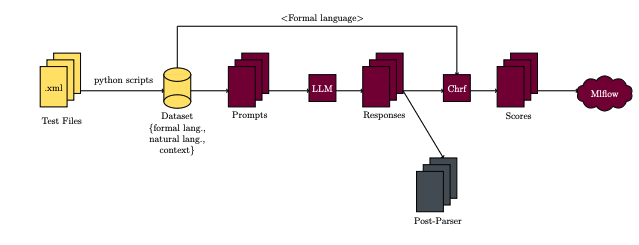
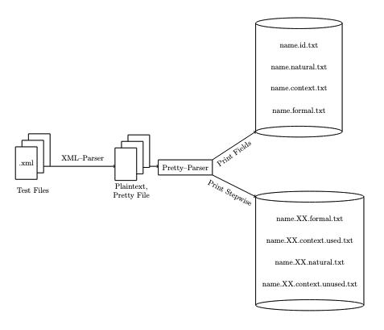
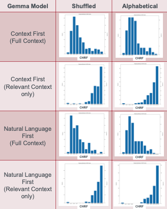

# Leveraging-Generative-AI-for-Test-Automation
Utilized generative AI models to read natural language descriptions of test cases and write the corresponding formal languages. 
## Introduction:
NLP is a branch of AI dedicated to the interaction
between human language and computers, including tasks
like translating natural language (e.g. English sentences)
into formal structures (e.g. code).

I worked on a collaborative project between [McSCert](https://mcscert.mcmaster.ca/) ad industrial partner. We were provided with a sample of industrial test cases
(formatted in XML) and utilized generative AI to transform
the natural language descriptions from these test cases
into a formal, code-like structure which we compared to
the original implementation.

## Structure of The Project:
<p align="center">
  
</p>
<div align="center"><em>Figure 1</em> </div>


<h2 style="text-align: center; background-color: grey; color: #FFE366;">Pre-Parsing (XML Parser):</h2>

- XML Data Extraction: An existing Python script
was used to parse the
provided industrial test
cases, extract relevant
information, and
consolidate it into a single
plaintext file named
“pretty.” This approach was
used for easy manual
modification of the dataset.

- Pretty File Parsing: Refined a Python script to
separate contents of "pretty" files into distinct files
based on sections like context, natural language,
formal language, ID or organized the data into stepwise
files with separate used and unused context, formal
and natural languages for each step.

<p align="center">
  
</p><div align="center"><em>Figure 2:</em> Pre-Parsing Workflow</div>


<h2 style="text-align: center; background-color: #D3D3D3; color: #79003B;">Generate Formal Language:</h2>

> - Takes pre-parsed data, prefix, and produces a prompt. Feeds
inputs to a specified pre-trained model. 

> - The model processes the input and produces the
corresponding formal language output.

> - Compute the CHRF score by comparing the expected and
actual strings. Then log the results to MLflow and run a post-
processing script to incorporate additional metrics if necessary.  

<br>

| <div style="font-size: 18px" align="center">Manipulating Generative AI Input:</div> |
|----------|
| <div align="center">1. Sort the context section in random or alphabetical order. For random shuffling, we use a seed to ensure the reproducibility of the shuffle.</div> |
| <div align="center">2. Rearrange the prompt by altering the order of natural language and context within the input provided to the generative AI.</div> |
| <div align="center">3. Progressively add irrelevant context to the used context and observe its impact on the generative AI's ability to produce the expected result</div> |

<br>
<br>
<div style="font-size: 18px" align="center"><strong>Observations from Input Manipulation</Strong>:</div>
<br>

* Note: The rightmost bin in the histogram represents a 100% CHRF score, indicating that the model's output exactly matched the expected result when converting natural language descriptions to formal language. Therefore, the further the graph is to the right, the better the model's performance.
1. Reordering the context section of the input had minimal effect on the model's performance or its ability to convert the natural language descriptions of the test cases into formal language, as indicated by the comparisons between column 1 and column 2 in Figure 3.
2. Similarly, rearranging the prompt given to the model—whether presenting the context first followed by the natural language, or the reverse—did not significantly affect the model's performance, as shown by the comparisons between rows 1 and 2 with rows 3 and 4 in Figure 3.
3. Lastly, the final input manipulation had the most significant impact. As seen in Figure 3, when the model is provided with precisely what it needs (relevant context only, as in rows 2 and 4), its performance improves considerably. In both rows 2 and 4, the histograms are skewed to the left, with most data points positioned towards the right of the x-axis, indicating that the model produced more accurate outputs for the natural language descriptions. In contrast, when the model is given all the information at once, as in rows 1 and 3, the histograms are skewed to the right, with most data points on the left side of the x-axis, suggesting that the model struggled to match the expected outcomes with its actual outputs for the natural language descriptions of the test cases.


<p align="center">
  
</p>

<div align="center"><em>Figure 3:</em> GEMMA model perfomance from input manipulations.</div>

<h2 style="text-align: center; background-color: white; color: #4C555C;">Post-Parsing (Formal Language Parser)</h2>

- This script processes the formal language output by the model and displays it on the
command line as a JSON string.
- **Input:** Formal language (provided either as a string or from a file)
- **Output:** Prints to the command line a list of dictionaries, with each dictionary representing a
command, or nested commands.
- **Example:**
```python
Input:
   * LOOP(4)
    * READ(varB, 0)
    * WRITE(varA, val) 

Output:
[
    {cmd: "loop", count: "4", inner: [
            { cmd: "read", mapping: "varB", value: "0" },
            { cmd: "write", mapping: "varA", value: "val" },
        ],
    },
]